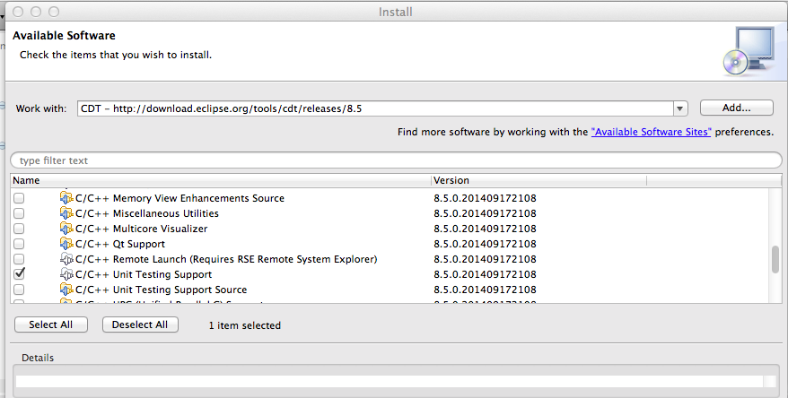
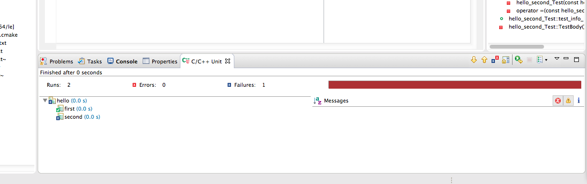

# Smartdb

## How to run test cases

### Getting Google Test

Download the latest [Google Test](https://code.google.com/p/googletest/downloads/list) source
and unzip it in `contrib/gtest` directory.

```bash
$ ls contrib/gtest/
CHANGES        CONTRIBUTORS   Makefile.am    README         build-aux      codegear       configure.ac   include        make           samples        src            xcode
CMakeLists.txt LICENSE        Makefile.in    aclocal.m4     cmake          configure      fused-src      m4             msvc           scripts        test
```

### Getting csv-parser-cplusplus

CSV storage engine depends on [csv-parser-cplusplus](https://code.google.com/p/csv-parser-cplusplus).

Get the latest [csv-parser-cplusplus](https://code.google.com/p/csv-parser-cplusplus/downloads/list) source,
and compile it to attain `libcsv_parser.a`.

Then copy `libcsv_parser.a` and `csv_parser.hpp` into `storage/csv/contrib/csv_parser/`.

```bash
$ ls storage/csv/contrib/csv_parser/
csv_parser.hpp  libcsv_parser.a
```

### Running via shell

```bash
$ cd test/unit
$ ./build.sh
$ ./run_gtest
```

### Running in Eclipse CDT

1. Get "C/C++ Unit Test" plugin.
    1. Help -> Install New Software.
    2. Work with: "CDT".
    3. Check "C/C++ Unit Testing Support" in "CDT Optional Features".
    4. Install it.

    
2. Make build configuration to create `test/unit/run_gtest` binary.
    1. Project -> Properties -> C/C++ Build -> Manage Configurations ...
    2. Create a configuration named "gtest".
    3. Return to "C/C++ Build" dialogue.
    4. Build command: `make`, build directory: `${workspace_loc:/smartdb}/test/unit/`.

    
3. Create configuration to build & run `test/unit/run_gtest` binary.
    1. **NOTE.** Execute `cmake . ; make` first in your shell. Eclipse requires `run_gtest` binary to exist.
    2. Run -> Run Configurations -> C/C++ Unit.
    3. C/C++ Application: `${workspace_loc:/smartdb}/test/unit/run_test`.
    4. Build configuration: "gtest".
    5. Argumnts tab => Working directory: `${workspace_loc:/smartdb}/test/unit`
    6. Apply.

    
4. Run unit test.
    1. Open "C/C++ Unit" view.
    2. Click "Rerun All Tests" button.

    
